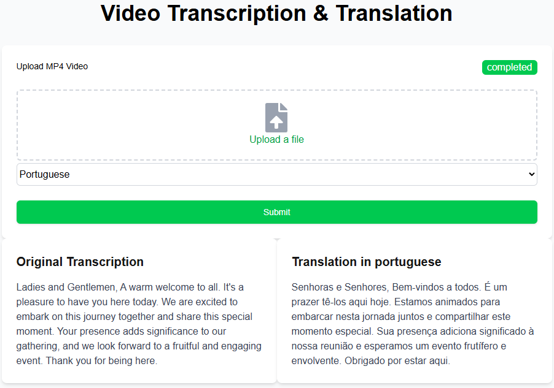

# 🎬 Video Translator App

A full-stack application that allows users to:
- Upload an MP4 video
- Select a target language
- Receive a translated transcript of the video's spoken content



Built with:
- **Backend**: Python FastAPI
- **Frontend**: Next.js
---

## 🚀 Features

- Upload MP4 videos via a web interface
- Automatic speech-to-text transcription (STT)
- Translation of transcript into selected target language
- RESTful API for handling uploads and translations

## Prerequisites
- Groq API key

## Setup
1. Clone the repository:
```bash
git clone https://github.com/taoufikbnr/video_transcription_translation.git
```
2. Create a `.env` file in the root directory with your API keys:
```
GROQ_API_KEY=your_groq_api_key
```
The application will run on:
- Frontend: http://localhost:3000
- Backend API: http://localhost:8000

### Backend Development
```bash
cd api
python -m venv venv
venv/bin/activate
pip install -r requirements.txt
uvicorn api.main:app --reload
```

### Frontend Development
```bash
cd frontend
npm install
npm run dev
```

